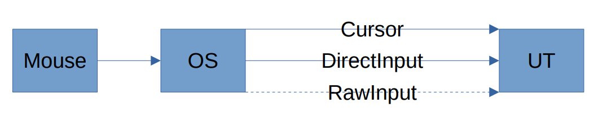
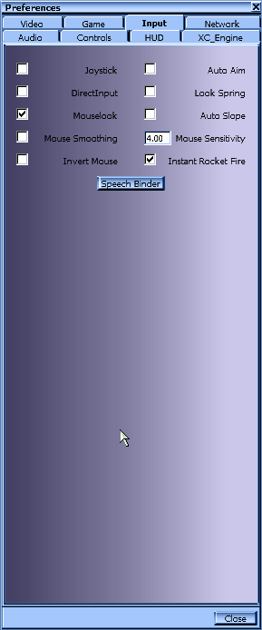

# Mouse Input in Unreal Tournament

Mouse input is a crucial part of the UT experience. Mouse input has changed with recent UT patches, and a new mouse input API has been added to select from. This document intends to provide an overview which mouse input APIs the game supports and their defining characteristics, as well as an overview over how different versions of the game process mouse input differently.

## Mouse Input APIs

From the beginning the game had support for two different mouse input APIs, two different ways of asking the operating system how far the mouse moved since the last time it asked the operating system for this information.  
With patch 469 another mouse input API was added to the game.

In UT v436, you only have the choice between Cursor and DirectInput, so if the DirectInput checkbox is not checked, the game implicitly uses the Cursor API.  

UT v469 adds the RawInput API, and reworks how you select the API because of this. You can now explicitly select between Cursor, DirectInput, and RawInput.  

### Cursor

This hides your mouse cursor, but places it in the middle of the screen, at known coordinates. Every frame the game looks at how far your mouse has moved away from the center in X/Y direction, then resets the cursor to the known coordinates. How far the mouse has moved is treated as mouse input for the game.

### DirectInput

This is an older API from the DirectX family of Windows APIs, designed for games. This bypasses the windows cursor behavior, and retrieves slightly processed mouse input from before it is turned into cursor movement.

### RawInput

This is a recent API that bypasses most, if not all, of the post-processing done by Windows. You can think of this as a direct connection between what the mouse sent to the operating system, and what the game gets from the operating system.

## Post-Processing of Mouse Input

After the game has retrieved mouse input from the selected API, it has to process the input and turn it into degrees of turning for a player. Unreal Tournament uses 65536 degrees for a full circle, instead of 360, so a one-to-one correspondence between pixels of mouse input and degrees of turning would result in a very low sensitivity. To help with this, there are many different factors applied to the mouse input, two of which are configurable, the rest are not.

Mouse input goes through many layers of processing on the way from the selected API to the Camera. Those can be clustered into roughly two blocks, Input and Player, the former of which is in C++, the latter is in UnrealScript.

### Input

This is the Unreal Engines input processing system that executes the desired actions when a key is pressed on the keyboard, it also handles joystick and mouse input through what is called an Axis.

An Axis is a way of connecting non-binary (not just on/off) inputs to the UnrealScript that actually executes game-specific actions.

Each Axis has an adjustable Speed value, which is multiplied with the value from the API before the result is forwarded to the Player module

### Player

This is game-specific code that converts the value from the Input system into a camera rotation that is then used to render an appropriate image.  
Rotations in the UnrealEngine are 16-bit unsigned integers (whole numbers from 0 to 65535). 
This means that there are 65536 directions you can look, or in other words a circle in UnrealEngine has 65536 degrees instead of 360, but there are no half-degrees. It also means that at some point the Player module has to round the number received from the Input system in some way to a whole number.

Before converting the value received from the Input system the Player module applies mouse sensitivity by multiplying it with the sensitivity and using the result from then on. It also corrects for the FOV used by the player by dividing the used FOV by 90 (roughly), and multiplying the received value with the result.

The way the Player module rounds the result of its calculations is what is different between versions 436 and 469.

### 436

In UT v436 the game always rounds towards 0 and discards everything past the decimal point. For example, if a single pixel of mouse input was received from the Mouse API, and the Input system and the Player module turned that into 2.9 degrees of turning, before rotating the Camera the 2.9 degrees are rounded to 2.0 degrees (discarding 0.9 degrees of rotation). This manifests as a sort of negative mouse acceleration, because it affects slow mouse movements more than fast movements. It is also affected by the client's frame-rate, because a higher frame-rate means the mouse is sampled more often within a given time, decreasing the average mouse movement per frame.

### 469

Starting with UT v469, the game no longer discards degrees of rotation past the decimal point, but preserves it for the next frame. What was discarded on one frame is added to the next, thereby preserving all of your mouse input.

## IG+

IG+ adds a client-side option called `bUseOldMouseInput` that allows switching between the different ways of rounding the rotation.  
`bUseOldMouseInput=False` makes IG+ use the 469 way of rounding the rotation.  
`bUseOldMouseInput=True` makes IG+ use the 436 way of rounding the rotation.

